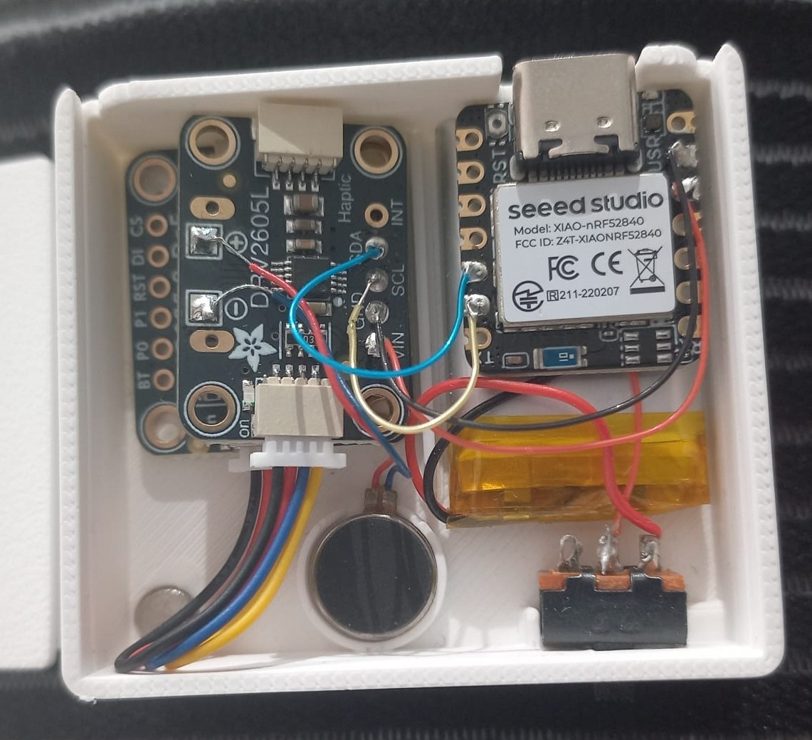
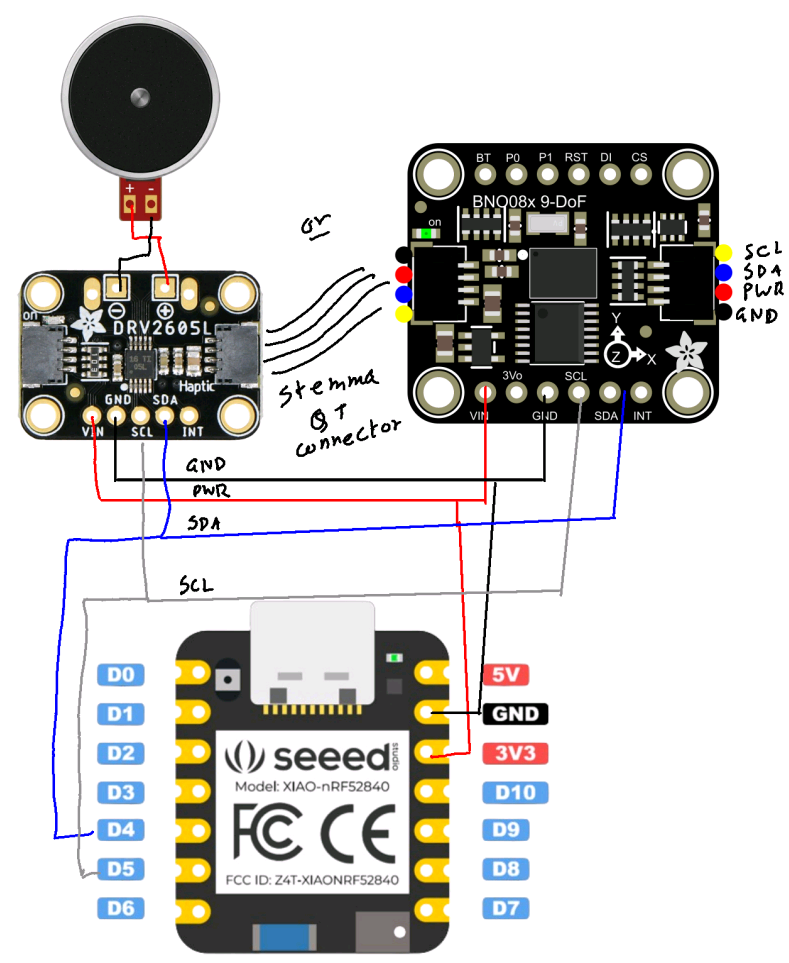
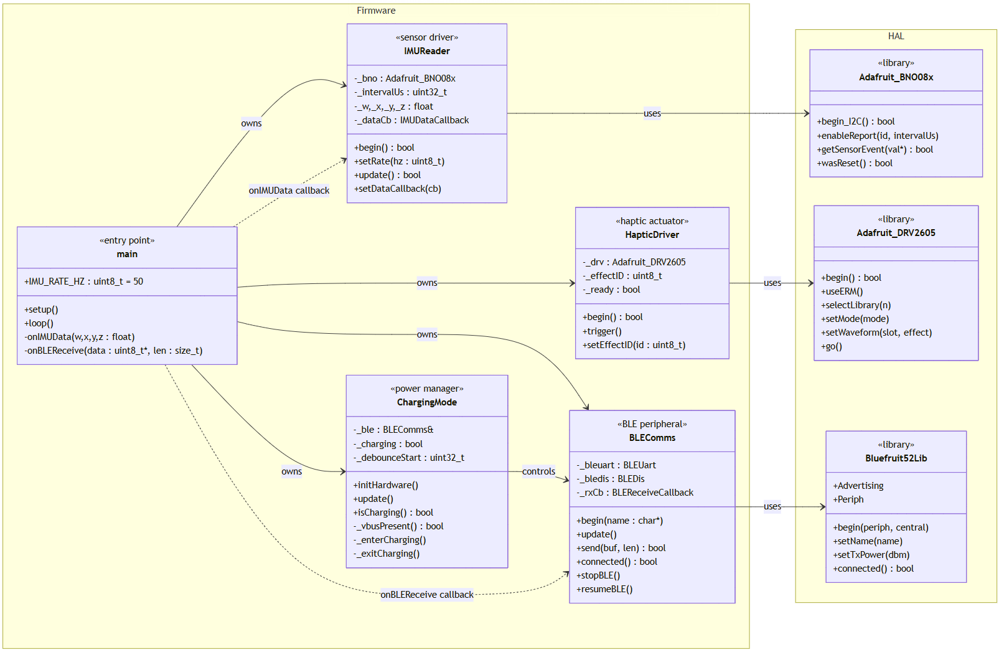
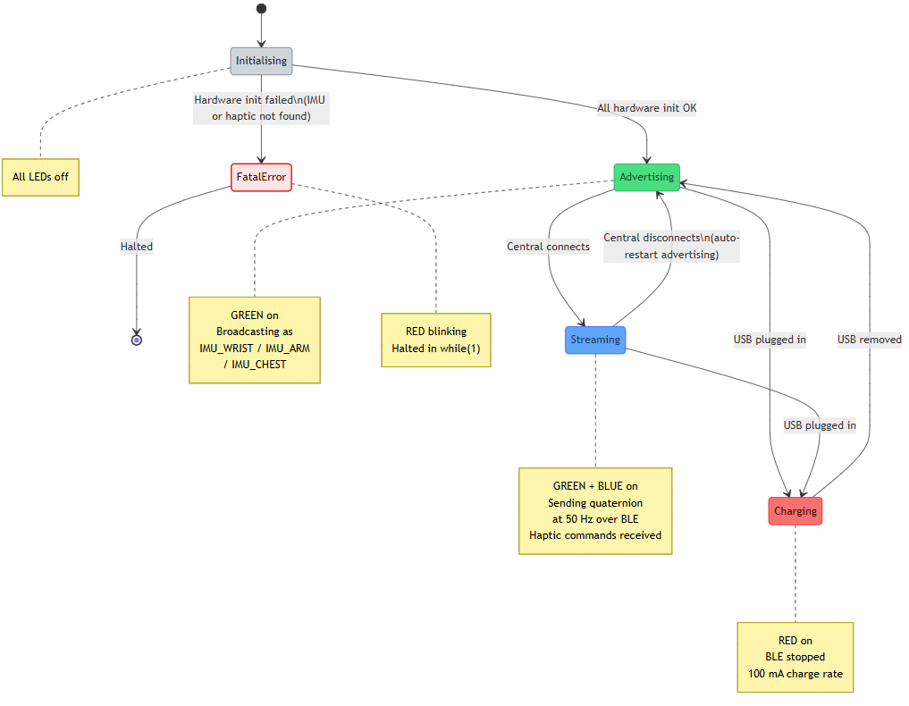

# IMU Sensor Node

Wearable motion-capture node built on the **Seeed Studio XIAO nRF52840**. Each node reads quaternion orientation from a **BNO085 IMU** at up to 250 Hz, streams it over BLE to a host PC, and can fire a haptic alert on command. Up to three nodes can run simultaneously, identified as `IMU_WRIST`, `IMU_ARM`, and `IMU_CHEST`.

---

## Hardware

### Components

| Component | Part | Notes |
|---|---|---|
| Microcontroller | Seeed Studio XIAO nRF52840 | ARM Cortex-M4, BLE 5.0, 250 mA charger IC |
| IMU | Adafruit BNO085 (BNO08x) | 6-axis GAME_ROTATION_VECTOR, no magnetometer |
| Haptic driver | Adafruit DRV2605L | ERM/LRA motor driver, I²C |
| Motor | Coin vibration motor | ERM, wired to DRV2605L OUT+/OUT− |
| Battery | LiPo 250 mAh | BAT+ / BAT− on XIAO header |



### Wiring

Both the BNO085 and DRV2605L share the I²C bus on **D4 (SDA) / D5 (SCL)**, running at 400 kHz. The BNO085 can be connected via its STEMMA QT connector.



| Signal | XIAO Pin | BNO085 | DRV2605L |
|---|---|---|---|
| SDA | D4 | SDA | SDA |
| SCL | D5 | SCL | SCL |
| 3.3 V | 3V3 | VIN | VIN |
| GND | GND | GND | GND |
| Motor | — | — | OUT+ / OUT− |

I²C addresses: BNO085 → `0x4A`, DRV2605L → `0x5A`.

**Charging:** The XIAO's USB-C port both powers the board and charges the LiPo at 100 mA (PIN22 / HICHG held LOW). VBUS presence is detected via `NRF_POWER->USBREGSTATUS`.

---

## Firmware

### Architecture

The firmware is structured as four single-responsibility C++ classes wired together in `main.cpp`:



| Class | Role |
|---|---|
| `IMUReader` | Configures BNO085, polls GAME_ROTATION_VECTOR, fires quaternion callback |
| `BLEComms` | Manages BLE UART peripheral, TX/RX callbacks, advertising lifecycle |
| `HapticDriver` | Wraps DRV2605L — loads waveform and fires on command |
| `ChargingMode` | Detects USB VBUS, suspends BLE + IMU loop while charging |

`main.cpp` owns all four instances. Data flows via two registered callbacks:
- **`onIMUData(w, x, y, z)`** — called by `IMUReader` on every new quaternion; packs 16 bytes of floats + 4 bytes of `millis()` timestamp and sends over BLE.
- **`onBLEReceive(data, len)`** — called by `BLEComms` on RX; handles `'H'` (haptic trigger + effect ID) and `'S'` (sync timestamp reply).

### State Machine



| State | LED | Behaviour |
|---|---|---|
| Initialising | All off | Hardware init in progress |
| FatalError | RED blinking | IMU or haptic not found; halted in `while(1)` |
| Advertising | GREEN on | BLE advertising as `IMU_WRIST` / `IMU_ARM` / `IMU_CHEST` |
| Streaming | GREEN + BLUE on | Quaternions sent at configured Hz; haptic commands accepted |
| Charging | RED on | USB detected; BLE stopped, IMU loop paused; 100 mA charge rate |

### BLE Packet Format

**TX (node → host):** 20-byte binary packet per sample.

| Bytes | Content |
|---|---|
| 0–3 | `float w` (quaternion real) |
| 4–7 | `float x` |
| 8–11 | `float y` |
| 12–15 | `float z` |
| 16–19 | `uint32_t millis()` timestamp |

**RX (host → node):**

| Byte(s) | Command |
|---|---|
| `0x48` + `<effect_id>` | Trigger haptic with DRV2605L effect ID |
| `0x53` | Sync request — node replies `SYNC:<millis>\r\n` |

### IMU Configuration

The firmware uses `SH2_GAME_ROTATION_VECTOR` — fused from accelerometer and gyroscope only. The magnetometer is excluded to eliminate heading jumps and compass dependency. The report interval is configurable:

```cpp
static const uint8_t IMU_RATE_HZ = 50;  // valid range: 10–250 Hz
```

Change `IMU_RATE_HZ` in `main.cpp` before flashing. The value is clamped and converted to a microsecond interval passed to `_bno.enableReport()`.

### Haptic Effects

The DRV2605L is configured for **ERM internal trigger** mode using library TS2200 set A. Effect #15 (750 ms Alert 100%) is the default. The host can specify any valid DRV2605L waveform ID by sending `0x48` followed by the effect byte.

---

## Build & Flash

### Requirements

- [PlatformIO](https://platformio.org/) (VS Code extension or CLI)
- Seeed Studio nRF52 board package (installed automatically by PlatformIO)

### Dependencies (auto-installed by PlatformIO)

```
adafruit/Adafruit BNO08x @ ^1.2.3
adafruit/Adafruit DRV2605 Library @ ^1.1.0
adafruit/Adafruit BusIO @ ^1.14.0
```

### Build

```bash
pio run
```

### Flash

```bash
pio run --target upload
```

### Serial Monitor

```bash
pio device monitor --baud 115200
```

### Changing the BLE Device Name

In `main.cpp`, comment/uncomment the appropriate `ble.begin()` line to set which body position this node represents:

```cpp
//ble.begin("IMU_WRIST");
//ble.begin("IMU_ARM");
ble.begin("IMU_CHEST");
```

---

## Host Software

The `test_scripts/` directory contains Python tools for connecting to one or more nodes.

### `imu_gui_v1.py` — Multi-node dashboard

Real-time GUI for up to three simultaneous nodes using [DearPyGui](https://github.com/hoffstadt/DearPyGui) and [Bleak](https://github.com/hbldh/bleak).

```bash
pip install bleak dearpygui
python test_scripts/imu_gui_v1.py
```

Features a scrolling Roll/Pitch/Yaw plot per node (last 8 s), packet counter, sync offset display, and per-node or broadcast haptic/sync buttons.

### `comm.py` — Simple BLE UART client

Basic connection script; useful for raw packet inspection.

### `sync.py` — Clock synchronisation utility

Sends sync requests and measures round-trip offset between node `millis()` and host time.

### `haptic_ble.py` — Haptic tester

Sends haptic trigger commands interactively to test different DRV2605L effect IDs.

---

## Project Structure

```
IMU_Sensor_Node/
├── src/
│   ├── main.cpp            # Entry point; wires all classes together
│   ├── IMUReader.cpp/h     # BNO085 quaternion driver
│   ├── BLEComms.cpp/h      # BLE UART peripheral
│   ├── HapticDriver.cpp/h  # DRV2605L haptic driver
│   └── ChargingMode.cpp/h  # USB charge detection & power management
├── test_scripts/
│   ├── imu_gui_v1.py       # Multi-node DearPyGui dashboard
│   ├── comm.py             # Simple BLE UART client
│   ├── sync.py             # Clock sync utility
│   └── haptic_ble.py       # Haptic effect tester
├── miscellaneous_scripts/
│   ├── BLE_SA_test.cpp     # Standalone BLE smoke test
│   ├── IMU_SA_test.cpp     # Standalone IMU smoke test
│   └── laptop_test*.py     # Early integration host scripts
├── imgs/                   # Architecture and hardware diagrams
└── platformio.ini          # PlatformIO build config
```

---

## Diagrams

| Diagram | Description |
|---|---|
| `imgs/Hardware_Diagram.png` | Component block diagram with pin assignments |
| `imgs/Wiring_Diagram.png` | Physical wiring schematic |
| `imgs/imu_firmware_class_diagram.png` | C++ class relationships and HAL dependencies |
| `imgs/imu_firmware_state_diagram.png` | Full firmware state machine with LED indicators |
| `imgs/IMU_Block_Diagram.png` | System-level data flow |
| `imgs/IMU_firmware.png` | Firmware overview |
